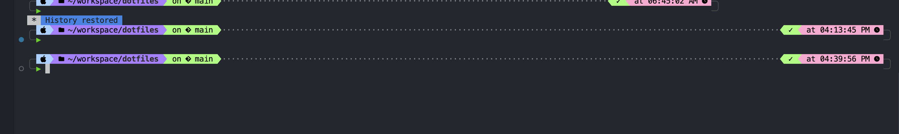

# Trev McDougald's Dotfiles

[](https://www.apple.com/macos/)
[](https://www.zsh.org/)
[](https://iterm2.com/)
[](https://cursor.sh/)
[](https://www.jetbrains.com/idea/)
[](https://brew.sh/)
[](https://git-scm.com/)
[](https://code.visualstudio.com/)

**Tags:** `zsh` `zshrc` `iterm2` `cursor` `vscode` `intellij` `jetbrains` `themes` `color-schemes` `macos` `homebrew` `dotfiles` `config` `development` `terminal` `shell` `ide` `editor`

A curated collection of development configuration files, themes, and setup scripts for macOS development environments.

## 📞 Contact

- **GitHub**: [@mcdougald](https://github.com/trevormcdougald)
- **Email**: mcdougald.job@gmail.com
- **Website**: [trev.fyi](https://trev.fyi)

## 📋 Overview

This repository contains my personal dotfiles and development configurations, organized for easy setup and sharing. It includes terminal themes, IDE color schemes, and various configuration files that help maintain a consistent development experience across machines.

## 🛠️ Tools & Technologies

- **Terminal**: iTerm2 with custom color schemes
- **IDEs**: IntelliJ IDEA / JetBrains IDEs with custom themes
- **Operating System**: macOS (Darwin)
- **Shell**: Zsh with Homebrew package manager
- **Version Control**: Git

## 🖥️ Terminal Preview



*My terminal setup featuring the DoomOne theme with Powerlevel10k prompt*

## Inspirations

- [mswell](https://github.com/mswell/dotfiles/blob/master/config/zsh/.zshrc)
- [narze](https://github.com/narze/dotfiles/blob/master/chezmoi/symlink_laptop.tmpl)
- [mark-hubers](https://github.com/mark-hubers/hubers-devtools-system/blob/main/terminal-config/home/.zsh/markdown-toolkit.zsh)

## 🎨 Available Themes

### Terminal Themes
- **DoomOne** - Dark theme inspired by Doom Emacs, perfect for coding sessions

### IDE Themes
- **Neo Light** - Clean, modern light theme for IntelliJ IDEA
- **Neo Night** - Dark counterpart with excellent contrast
- **Ppy Light** - Alternative light theme with subtle color variations
- **Ppy Light2** - Enhanced version of the Ppy light theme

## 📁 Repository Structure

```
├── assets/              # Screenshots and images
│   └── terminal-screenshot.png
├── themes/
│   ├── iterm/           # iTerm2 color schemes
│   └── *.icls           # IntelliJ IDEA color schemes
├── Brewfile             # Homebrew package list
├── dotfiles.code-workspace  # VS Code workspace configuration
└── README.md            # This file
```

## 🚀 Quick Start

1. Clone this repository:
   ```bash
   git clone https://github.com/trevormcdougald/public-dotfiles.git
   cd public-dotfiles
   ```

2. **Install iTerm2 themes:**
   - Open iTerm2 → Preferences → Profiles → Colors
   - Click "Color Presets" → "Import"
   - Select `themes/iterm/DoomOne.itermcolors`

3. **Install IDE themes:**
   - Open IntelliJ IDEA → File → Settings → Editor → Color Scheme
   - Click the gear icon → "Import Scheme"
   - Select any `.icls` file from the `themes/` directory

## 📄 License

This project is open source and available under the [MIT License](LICENSE).

## 🤝 Contributing

Feel free to submit issues, fork the repository, and create pull requests for any improvements.

---

*Last updated: $(date +'%Y-%m-%d')*
