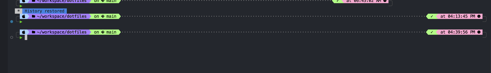

# Trev McDougald's Dotfiles

[](https://www.apple.com/macos/)
[](https://pop.system76.com/)
[](https://www.zsh.org/)
[](https://github.com/romkatv/powerlevel10k)
[](https://starship.rs/)
[](https://iterm2.com/)
[](https://herdr.dev/)
[](https://zellij.dev/)
[](https://brew.sh/)
[](https://mise.jdx.dev/)
[](https://git-scm.com/)

[](https://opencode.ai/)
[](https://claude.com/claude-code)
[](https://github.com/features/copilot)
[](https://antigravity.google/)
[](https://cursor.sh/)
[](https://zed.dev/)
[](https://code.visualstudio.com/)
[](https://helix-editor.com/)
[](https://www.jetbrains.com/idea/)

**Tags:** `dotfiles` `zsh` `zshrc` `powerlevel10k` `starship` `iterm2` `herdr` `zellij` `opencode`
`claude-code` `agents` `agents-md` `ai-coding-agents` `mcp` `copilot` `cursor` `zed` `antigravity`
`helix` `vscode` `intellij` `jetbrains` `lazygit` `mise` `direnv` `ripgrep` `bat` `fd` `ruff`
`themes` `color-schemes` `macos` `pop-os` `ubuntu` `homebrew` `config` `development` `terminal`
`shell` `ide` `editor`

A curated collection of development configuration files, themes, agent setups, and bootstrap
scripts for macOS and Pop!_OS development environments.

## 📞 Contact

- **GitHub**: [@mcdougald](https://github.com/trevormcdougald)
- **Email**: mcdougald.job@gmail.com
- **Website**: [trev.fyi](https://trev.fyi)

## 📋 Overview

This repository contains my personal dotfiles and development configurations, organized for easy
setup and sharing. It covers the shell, the terminal, editors and IDEs, the CLI tooling that sits
between them, and the AI coding agents that now do a lot of the typing — kept consistent across
machines and operating systems.

## 🛠️ Tools & Technologies

- **Shell**: Zsh with Powerlevel10k (`.zshrc`, `p10k.customizations.zsh`) or Starship
- **Terminal**: iTerm2 with custom color schemes
- **Multiplexers**: [Herdr](https://herdr.dev) (agent-aware), Zellij
- **AI agents**: [opencode](https://opencode.ai), [Claude Code](https://claude.com/claude-code),
  GitHub Copilot, Cursor, Antigravity — with a shared `AGENTS.md` convention
- **Editors / IDEs**: Zed, Helix, VS Code, Cursor, IntelliJ IDEA
- **CLI tooling**: ripgrep, fd, bat, lazygit, delta, jq, mise, direnv, ruff, taplo
- **Package managers**: Homebrew (`Brewfile`), mise for runtimes
- **Operating systems**: macOS (Darwin), Pop!_OS / Ubuntu Linux

## 🖥️ Terminal Preview



*My terminal setup featuring the DoomOne theme with Powerlevel10k prompt*

## 📁 Repository Structure

```
├── .config/                  # XDG configs — see .config/README.md
│   ├── opencode/             # opencode: config, TUI, AGENTS.md, agents, commands
│   ├── claude/               # Claude Code settings
│   ├── agents/               # AGENTS.md template for any repo
│   ├── copilot/              # GitHub Copilot settings fragment
│   ├── antigravity/          # Antigravity User settings + keybindings
│   ├── herdr/                # Herdr multiplexer: config, plugins, helper scripts
│   ├── zed/ helix/ zellij/   # Editors and multiplexer
│   ├── bat/ fd/ ripgrep/     # CLI tooling
│   ├── git/ gh/ lazygit/     # Git stack
│   ├── mise/ direnv/         # Runtimes and per-directory environments
│   ├── ruff/ taplo/          # Formatters/linters
│   ├── iterm2/ raycast/      # macOS apps
│   ├── starship.toml         # Starship prompt
│   └── link-macos.sh         # One-shot symlink installer
├── scripts/
│   ├── ai/                   # AI/dev environment checks
│   ├── cloud/                # aws / gcp / fly / vercel / k8s "who am I" helpers
│   ├── macos/                # kill-port, flush-dns, listening-ports, open-repo
│   └── keep-awake.sh         # Keep the machine awake
├── setups/
│   ├── setup_new.sh          # New-machine bootstrap
│   ├── setup_pop_os_2026.sh  # Full Pop!_OS provisioning
│   └── pop-os                # Entrypoint wrapper (all | terminal | setup | zshrc)
├── themes/
│   ├── iterm/                # iTerm2 color schemes
│   └── *.icls                # IntelliJ IDEA color schemes
├── assets/                   # Screenshots and images
├── .zshrc                    # macOS Zsh config
├── .zshrc-ubuntu             # Pop!_OS / Ubuntu Zsh config
├── p10k.customizations.zsh   # Powerlevel10k prompt customizations
├── Brewfile                  # Homebrew package list
├── macos-defaults.sh         # macOS system defaults
└── dotfiles.code-workspace   # VS Code workspace
```

## 🚀 Quick Start

1. Clone this repository:
   ```bash
   git clone https://github.com/trevormcdougald/dotfiles.git
   cd dotfiles
   ```

2. **Link the app configs (macOS):**
   ```bash
   bash .config/link-macos.sh
   ```
   Links Zed, Herdr, Claude Code, opencode, and Antigravity. It retargets existing symlinks and
   backs up any real file it replaces. Read it first — see [`.config/README.md`](.config/README.md)
   for what is intentionally *not* linked (Raycast, Cursor/VS Code).

3. **Install packages:**
   ```bash
   brew bundle --file=Brewfile
   ```

4. **Install iTerm2 themes:**
   - iTerm2 → Preferences → Profiles → Colors
   - "Color Presets" → "Import" → `themes/iterm/DoomOne.itermcolors`

5. **Install IDE themes:**
   - IntelliJ IDEA → Settings → Editor → Color Scheme
   - Gear icon → "Import Scheme" → any `.icls` file in `themes/`

## 🤖 AI Coding Agents

Agent config is first-class here, and the tools are wired to share one set of conventions.

| Tool | Config | Notes |
| --- | --- | --- |
| [opencode](https://opencode.ai) | [`.config/opencode/`](.config/opencode/README.md) | Runtime + TUI config, global `AGENTS.md`, custom subagents (`@review`, `@debug`) and commands (`/commit`, `/review`, `/test`, `/explain`). |
| [Claude Code](https://claude.com/claude-code) | `.config/claude/settings.json` | Model, effort level, statusline, plugin marketplaces. |
| GitHub Copilot | `.config/copilot/`, `.config/.vscode/user-settings.json` | Settings fragment for VS Code / Cursor. |
| [Antigravity](https://antigravity.google/) | `.config/antigravity/User/` | VS Code–style settings and keybindings. |
| Any repo | [`.config/agents/AGENTS.md`](.config/agents/AGENTS.md) | Drop-in template for shared, tool-agnostic project instructions. |

opencode's `instructions` setting also pulls in `CLAUDE.md`, `.cursor/rules/*.md`, and
`.github/copilot-instructions.md`, so a repo's conventions apply no matter which agent is reading
them.

**Permissions are an allowlist.** opencode's bash rules start at `ask`, then open up read-only
inspection, git history, `gh` reads, and test/build/lint runners. Mutating git, network fetches,
and infra tools stay on `ask`; `sudo`, force pushes, `rm -rf /`, and pipe-to-shell are denied.
Credentials never live in this repo — opencode keeps them in
`~/.local/share/opencode/auth.json`.

## 🖲️ Terminal Multiplexing

[Herdr](https://herdr.dev) is the agent-aware multiplexer driving the day-to-day setup:
`.config/herdr/` carries the config, plugin configs, an install script, and helper scripts for
theme picking, the file explorer, and sidebar patching. See
[`.config/herdr/README.md`](.config/herdr/README.md) for install, reload, keybindings, and
worktree integration. Zellij config lives alongside it in `.config/zellij/`.

## 🧰 Scripts

```bash
scripts/keep-awake.sh              # keep the machine awake
scripts/macos/kill-port.sh 3000    # free a port
scripts/macos/listening-ports.sh   # what is listening
scripts/macos/flush-dns.sh         # flush the DNS cache
scripts/cloud/cloud-whoami.sh      # identity across aws / gcp / azure / kubectl
scripts/cloud/saas-whoami.sh       # identity across vercel / fly / netlify / railway / cloudflare / doppler
scripts/cloud/k8s-context.sh       # current kube context
scripts/cloud/tls-expiry.sh host   # TLS certificate expiry (defaults to :443)
scripts/ai/ai-dev-check.sh         # AI/dev toolchain health check
```

## 🎨 Available Themes

### Terminal Themes
- **DoomOne** — dark theme inspired by Doom Emacs, perfect for coding sessions

### IDE Themes
- **Neo Light** — clean, modern light theme for IntelliJ IDEA
- **Neo Night** — dark counterpart with excellent contrast
- **Ppy Light** — alternative light theme with subtle color variations
- **Ppy Light2** — enhanced version of the Ppy light theme

## 🐧 Pop!_OS Setup

Use the single entrypoint script: `setups/pop-os`.

```bash
# from repo root
chmod +x setups/pop-os
./setups/pop-os
```

This default `all` mode will:

- Run the full Pop!_OS machine setup via `setups/setup_pop_os_2026.sh`
- Apply `./.zshrc-ubuntu` to `~/.zshrc` (with automatic backup)
- Install enhanced terminal UX stack: Oh My Zsh + Powerlevel10k + Meslo Nerd Font + plugin suite

Optional modes:

```bash
# terminal-only fast path (recommended for shell UX upgrades)
./setups/pop-os terminal

# setup only (packages/dev tooling)
./setups/pop-os setup

# zshrc only
./setups/pop-os zshrc

# help
./setups/pop-os help
```

After running setup:

- Restart shell: `exec zsh`
- Set your terminal font to `MesloLGS NF` for Powerlevel10k glyphs
- Run first-time prompt wizard: `p10k configure`
- If added to docker group, log out/in once
- Verify key tools: `brew doctor && docker --version && gh --version`

## 🍎 macOS Setup

```bash
bash macos-defaults.sh      # developer-friendly system defaults (review it first)
bash setups/setup_new.sh    # new-machine bootstrap
```

## Inspirations

- [mswell](https://github.com/mswell/dotfiles/blob/master/config/zsh/.zshrc)
- [narze](https://github.com/narze/dotfiles/blob/master/chezmoi/symlink_laptop.tmpl)
- [mark-hubers](https://github.com/mark-hubers/hubers-devtools-system/blob/main/terminal-config/home/.zsh/markdown-toolkit.zsh)

## 📄 License

Open source under the [MIT License](https://opensource.org/licenses/MIT). A `LICENSE` file has
not been committed yet.

## 🤝 Contributing

Feel free to submit issues, fork the repository, and create pull requests for any improvements.

---

*Last updated: 2026-08-21*
